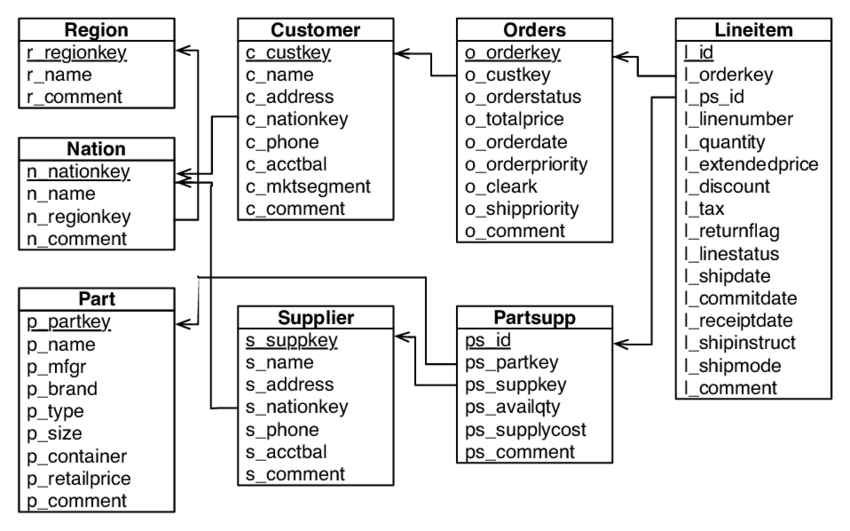

# Beerwulf.Data.Assessment - Data Engineer Interview Assessment

Welcome to the Beerwulf Data Engineering Interview Assessment. In this assessment we will test you on not only on your technical and coding skills but also on your line of thought, understanding of basic data modeling, and how to approach data problems.

The assessment is a small ETL Project as explained below.
## Once you complete the assessment
You can zip the latest solution and send Drive/Dropbox/OneDrive link to us.
# The Project
Build a simplified ETL process to digest the provided dataset into a star schema.
The goal here is to have a small set of fact and dimension tables in which stakeholders could rely on to extract data insights or use in reports.

### Tools and Technologies
We propose you to use Python and SQL. If you want to use a different stack, please make sure to communicate and explain us why.

Also, feel free to use additional/surrounding tools or tech stack. Be careful to use open-source technology so that we are able to replicate and use your code on our side.

What do you need to do
-----------------------
Clone this repo, build your ETL process and prepare it to be runnable in a easy way. 

#### What we expect from your assessment
* Quick and dirt instructions to run your code.
* Use best practices. Pro-tip: Modularize your code!
* We expect you to be able to explain the whole process in an interview.
* We expect you to finish this assessment in 2-4 hours, but rest assured: we will give you enough time for you to plan your work properly. 

Instructions
--------- 

1. The data for this exercise can be found in the `data.zip` file.

2. Design a star schema model with facts and dimensions, generate the load scripts to populate the schema. Provide the load scripts, alongside an Entity Relationship Diagram (You can use any of the online ERD softwares available, export an image and upload it). 

**Extra** point: 
- define a classification (it can be anything you want) for breaking the customer account balances into 3 logical groups
- add a field for this new classification
- add revenue per line item

#### Considering the Microsoft Azure Data Stack, answer the questiosn below:

3. Describe how you can schedule this process to run multiple times per day.
 
**Extra** point: 
- What would you do to cater for data arriving in random order?
- What about if the data comes from a stream, and arrives at random times?

4. Describe how you would deploy your code to production, and allow for future maitenance. 

5. A Data Warehouse is highly used to deliver insights to end-users from different departments. Can you use the designed star schema to come up with optimized SQL statements to answer the following questions:

   a. What are the bottom 3 nations in terms of revenue?
 
   b. From the top 3 nations, what is the most common shipping mode?

   c. What are the top 5 selling months?

   d. Who are the top customer(s) in terms of either revenue or quantity?

   e. Compare the sales revenue on a financial year-to-year (01 July to 30 June) basis.

ERD
--

