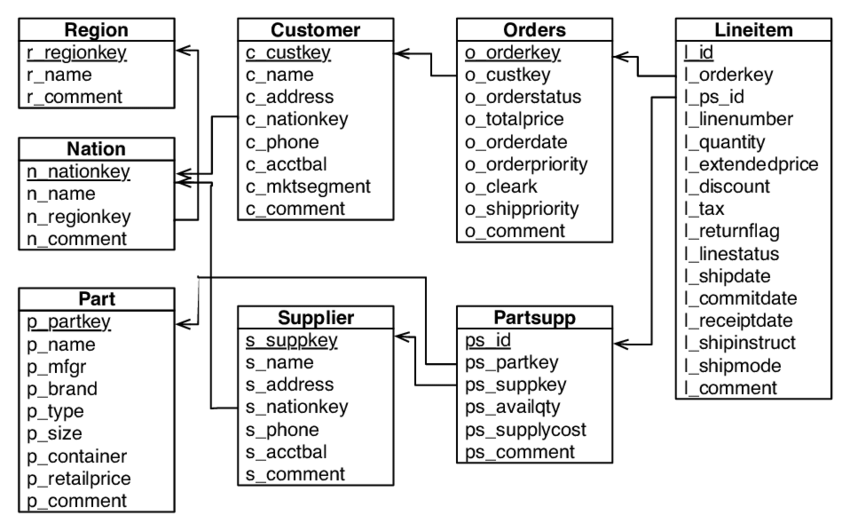

# Beer Ecommerce Data

# The Project
Build a simplified ETL process to digest the provided dataset into a star schema.
The goal here is to have a small set of fact and dimension tables in which stakeholders could rely on to extract data insights or use in reports.

To Do:
-----------------------
build an ETL process and prepare it to be runnable in an easy way. 

Instructions
--------- 

1. The data for this exercise can be found in the `data.zip` file.

2. Design a star schema model with facts and dimensions, generate the load scripts to populate the schema. Provide the load scripts, alongside an Entity Relationship Diagram (You can use any of the online ERD softwares available, export an image and upload it). 

Questions:
--------- 

   a. What are the bottom 3 nations in terms of revenue?
 
   b. From the top 3 nations, what is the most common shipping mode?

   c. What are the top 5 selling months?

   d. Who are the top customer(s) in terms of either revenue or quantity?

   e. Compare the sales revenue on a financial year-to-year (01 July to 30 June) basis.

ERD
--

